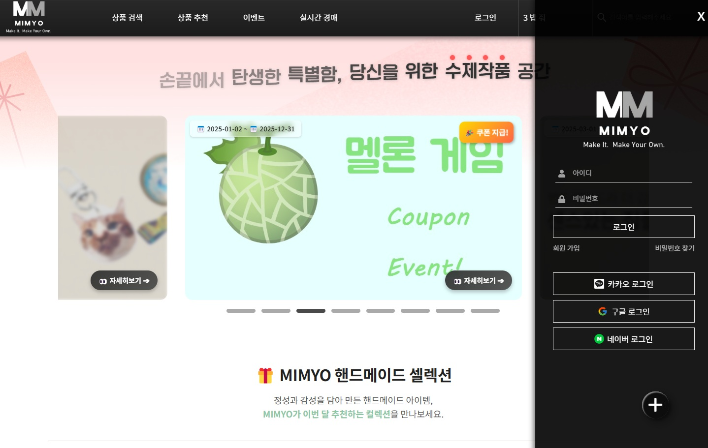

# 🧵 핸드메이드 쇼핑몰 - [ MIMYO ]

> 정성 가득한 핸드메이드 상품을 거래하는 커머스 플랫폼

 <!-- 스크린샷 경로는 알아서 수정 -->

---

📄 [프로젝트 상세 소개서 보기 (PDF)](https://drive.google.com/file/d/1ZVTpuval2WbT_x1n-3tOS7dhkpnCJQ8C/view?usp=drive_link)  
🌐 [👉 MIMYO 서비스 바로가기](https://mimyo.my)

## 🛠️ 주요 기술 스택

### 📌 Frontend
- React 22 / Redux Toolkit
- Styled Components / Tailwind CSS
- Chart.js (통계 시각화)
- CKEditor
- Axios / React Router
- WebSocket (실시간 채팅, 경매)

### 📌 Backend
- Spring Boot / Spring Security / JWT 인증
- JPA / Hibernate
- MySQL / QueryDSL / Native SQL
- AWS / Naver Cloud / Ubuntu / Certbot (HTTPS)
- WebSocket / STOMP (실시간 경매, 채팅)

---

## 💡 프로젝트 기획 의도

> **실시간 + 커뮤니케이션 + 편의성**을 갖춘  
> 새로운 형태의 핸드메이드 커머스 플랫폼

---

### 🎯 기획 배경

- 핸드메이드 시장의 성장과 개인 맞춤형 상품 수요 증가  
- 작가와 소비자 간 **실시간 소통**을 통해 고유성과 희소성을 극대화  
- 대량생산 제품과 차별화된 **개성 중심의 쇼핑 경험** 제공

---

### ✅ 기대 효과

#### 👤 사용자 측면 기대 효과
- 유니크한 제품과 작가와의 1:1 소통 경험  
- 요청 제작, 리뷰, 후기 등 커뮤니티형 쇼핑 UX 구현

#### 👩‍🎨 판매자 측면 기대 효과
- 자체 브랜드 및 제품 노출 기회  
- 결제, 배송, 리뷰 등 기능 통합으로 제작에만 집중 가능

#### 🧑‍💼 관리자 측면 기대 효과
- 정산, 광고, 배너, 상품 등록을 통한 수익 구조 마련  
- 데이터 기반 상품 추천/분석 기능 내장

#### 💻 기술/개발 측면 기대 효과
- WebSocket, JWT, STOMP 기반의 실시간 통신 기능 직접 설계 및 운영  
- 회원가입 ~ 결제 ~ 정산까지 E2E 시스템 구축 경험

#### 📈 마케팅/비즈니스 측면 기대 효과
- 틈새시장 공략 및 감성 중심 타겟팅  
- 후기 공유 및 커뮤니티 요소로 브랜드 충성도 증가


## 🎯 핵심 기능

### 🛒 쇼핑 기능
- 일반 상품 & 경매 상품 분리
- 실시간 경매 참여, 자동 입찰 마감
- 찜 / 장바구니 / 쿠폰 할인 / 리뷰 작성

### 💳 주문 및 결제
- Toss Payments 연동
- 일반 결제 및 경매 낙찰 결제 처리
- 재고 동시성 처리 (판매중지 자동 전환)

### 👩‍🎨 판매자 기능
- 상품 등록/수정/삭제
- 월별 정산, 판매 통계 대시보드
- 실시간 배송 관리 (1분 후 자동 배송 완료 처리)

### 📊 관리자/유저 기능
- 마이페이지 (구매 내역, 포인트 적립, 문의 내역)
- 유저 활동 통계 (문의 수, 구매 금액 등)
- 이벤트 페이지 (쿠폰/홍보 링크 전환)

---

## 📦 폴더 구조 예시

```bash
📁 backend
 └── src/main/java/com/ict/serv
     ├── config       # 설정 파일 (Swagger, CORS, WebSocket 등)
     ├── context      # 사용자 인증 컨텍스트
     ├── controller   # REST API 컨트롤러
     ├── dto          # 요청/응답 DTO
     ├── entity       # JPA 엔티티
     ├── repository   # DB 접근 레이어
     ├── schedule     # 스케줄러 (예: 배송 자동 완료)
     ├── security     # JWT 및 OAuth2 보안 처리
     ├── service      # 비즈니스 로직
     ├── util         # 공용 유틸 클래스
     └── ServApplication.java  # 메인 실행 파일
 └── uploads          # 이미지 업로드 저장소
 └── resources         # 설정 파일 (application.yml 등)

📁 frontend
 └── src
     ├── css          # 공통 CSS
     ├── effect       # 애니메이션 / 인터랙션 효과
     ├── img          # 이미지 리소스
     ├── interact     # 공통 컴포넌트/인터랙션 핸들링
     ├── modal        # 팝업/모달 관련 UI
     ├── store        # Redux 상태 관리
     └── view         # 실제 페이지 구성
         ├── admin              # 관리자 페이지
         ├── auction            # 경매 관련 페이지
         ├── customerservice    # 고객센터, 문의 등
         ├── event              # 이벤트 페이지
         ├── product            # 상품 상세, 목록 등
         ├── recommend          # 추천 시스템
         ├── shipping           # 배송 조회/관리
         ├── submenu            # 서브 메뉴, 네비게이션 등
         └── user               # 마이페이지, 회원 관련
     ├── Header.jsx / Footer.jsx / Main.jsx 등 공통 레이아웃

📁 public               # 정적 파일 (favicon, index.html 등)
```
---

## 🙋🏻‍♀️ 담당 역할 - 양현의 (부조장)

### 🧱 백엔드 
- 일반 회원가입 기능 구현 및 이메일 인증
- 마이페이지 일부 구현
  - 프로필 사진, 팔로워/팔로잉, 판매작품, 리뷰 등 사용자 정보 조회 기능 구현
  - 방명록 글쓰기, 답글 달기, 삭제 기능 구현
- 웹소켓 STOMP를 통한 실시간 채팅 기능 구현
  - 실시간 채팅 읽음 / 읽지 않음 / 나가기 처리
  - 새로운 채팅 수신 시 채팅 내역 실시간 업데이트
  - float 버튼 채팅 아이콘 10초 주기로 실시간 알림 업데이트
- 상품 추천 알고리즘 설계
- 경매 동시성 이슈 블락처리
- 실시간 검색어 기능 구현

### 🧠 프론트
- 일반 회원가입 페이지 디자인
- 메인페이지 헤더 반응형, 햄버거 버튼 / 대시보드 반응형 햄버거 버튼 구현
- 프로필 페이지 디자인
- 장바구니 페이지 디자인
- 채팅 내역 및 채팅방 디자인
- 상품 추천 페이지 디자인
- 주문 결제 페이지 영수증 디자인 
- 실시간 검색어 디자인
- 경매 페이지 인기 경매 / 마감 임박 경매 필터링 구현
- 전체 페이지 모바일 반응형 구현
- 판매 내역 엑셀 다운로드 구현

---

## 📝 MIMYO 후기

**양현의 - 부조장**

이번 쇼핑몰 사이트 프로젝트는 규모가 큰 만큼, 기본적인 기능 구현을 넘어서 
**다양한 부가 기능들을 직접 기획하고 적용**해볼 수 있다는 점에서 매우 의미 있었습니다.
특히 채팅 기능을 구현할 때는 단순한 메시지 송수신을 넘어, **실시간 읽음 확인, 채팅방 나가기, 알림 기능** 등
실제 서비스에 가까운 요소들을 추가하며 사용자 경험을 세심하게 고려하려 노력했습니다.
이 과정에서 사소해 보이는 부분도 놓치지 않고 꼼꼼히 점검하는 습관이 길러졌고, 
세부 기능 하나하나가 얼마나 중요한지를 체감할 수 있었습니다.

또한 Redux를 처음 접하면서 **상태 관리를 체계적으로 다루는 법**을 배웠고, 
**재사용 가능한 구조를 갖춘 코드의 효율성과 유지보수의 편리함**을 몸소 느낄 수 있었습니다.
처음에는 막막하게 느껴졌던 기능들도 팀원들과 끊임없이 소통하고 역할을 분담하며 함께 해결해나갔고, 
그 과정에서 **협업의 가치와 팀워크의 중요성**을 다시 한번 깊이 깨달았습니다.
이번 프로젝트는 단순한 기능 구현 이상의 경험을 제공해주었고, 기술적인 역량뿐 아니라 
**문제 해결력, 커뮤니케이션 능력**까지도 함께 성장할 수 있었던 소중한 기회였습니다.

> `2025.05.08 마무리`
